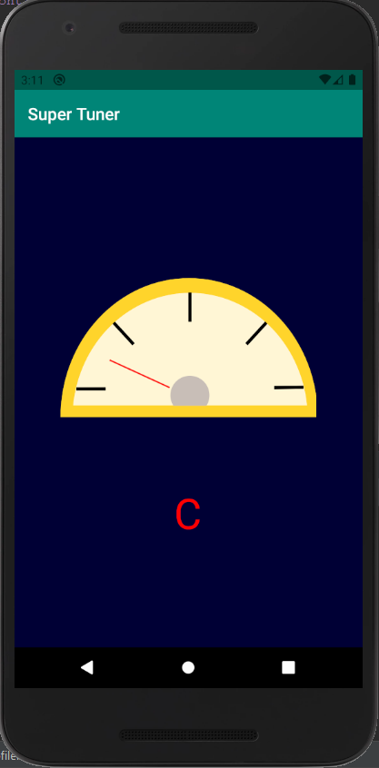

# Guitar Tuner
### An Android app to help you tune your guitar or other musical instrument
### By Alex Tuck

Samples the audio signal and analyzes audio using a Discrete Fourier Transform. The app will tell you which frequency in the signal is the loudest.

